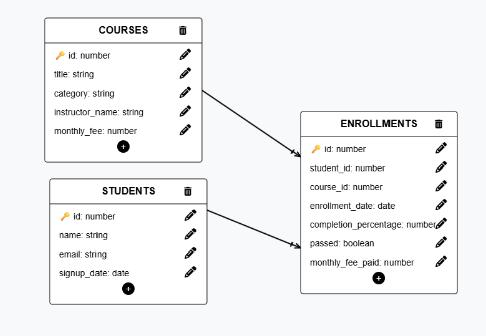

# Informe de Auditoría v2 — EduTrack (esquema normalizado)

**Autor:** Daniel Rojas Montañez
**Fuente:** base de datos importada desde `edutrack_v2.sql` en Supabase
**Consultas:** ver `queries.sql`
**Diagrama E/R:** ver `diagram.png`

---

# Diagrama entidad-relación

- `students (id PK)` **1 : n** `enrollments (student_id FK → students.id)`
- `courses (id PK)` **1 : n** `enrollments (course_id FK → courses.id)`
- `students` **n : m** `courses`, resuelta mediante la tabla intermedia `enrollments`

---

# INNER JOIN

## 1. Inscripciones con nombre del estudiante, curso y % completado

Resultado: **16 filas** (todas las inscripciones tienen estudiante y curso válidos).

| student_name    | course_title           | completion_percentage |
|-----------------|------------------------|----------------------:|
| Emily Watson    | Intro to Python        | 85 |
| Emily Watson    | Web Design Basics      | 60 |
| Klaus Weber     | Intro to Python        | 92 |
| Klaus Weber     | Data Analysis with SQL | 78 |
| Lucia Fernandes | Web Design Basics      | 5  |
| Lucia Fernandes | Digital Marketing 101  | 3  |
| Marco Rossi     | Advanced Python        | 95 |
| Marco Rossi     | Intro to Python        | 88 |
| Yuki Nakamura   | Data Analysis with SQL | 45 |
| Yuki Nakamura   | UI/UX Fundamentals     | 0  |
| Pierre Dubois   | UI/UX Fundamentals     | 0  |
| Priya Sharma    | Digital Marketing 101  | 70 |
| Priya Sharma    | Intro to Python        | 55 |
| Pierre Dubois   | Data Analysis with SQL | 20 |
| Emily Watson    | Advanced Python        | 40 |
| Lucia Fernandes | Advanced Python        | 0  |

## 2. Estudiantes que han aprobado al menos un curso

Resultado: **6 aprobados**, correspondientes a **4 estudiantes distintos**.

| name          | email                               | passed_course          |
|---------------|-------------------------------------|------------------------|
| Emily Watson  | emily.watson@student.edutrack.com   | Intro to Python        |
| Klaus Weber   | klaus.weber@student.edutrack.com    | Intro to Python        |
| Klaus Weber   | klaus.weber@student.edutrack.com    | Data Analysis with SQL |
| Marco Rossi   | marco.rossi@student.edutrack.com    | Advanced Python        |
| Marco Rossi   | marco.rossi@student.edutrack.com    | Intro to Python        |
| Priya Sharma  | priya.sharma@student.edutrack.com   | Digital Marketing 101  |

## 3. % de completado medio por instructor (mayor a menor)

| instructor_name    | average_completion |
|--------------------|-------------------:|
| Marta López        | 66.14 |
| Carlos Vega        | 40.00 |
| Lucia Prades       | 36.50 |
| Pending assignment | 0.00  |

> "Pending assignment" no es un instructor real, sino un valor de relleno en `courses.instructor_name` (curso *UI/UX Fundamentals*). Sus 2 inscripciones tienen un 0 % de completado.

---

# LEFT JOIN — detección de datos faltantes

## 4. Estudiantes sin ninguna inscripción

Resultado: **1 estudiante**.

| id | name          | email                              |
|---:|---------------|------------------------------------|
| 8  | Giulia Romano | giulia.romano@student.edutrack.com |

## 5. Cursos sin ninguna inscripción

Resultado: **1 curso**, candidato a archivarse.

| id | title           |
|---:|-----------------|
| 7  | Email Campaigns |

---

# Agregación entre tablas

## 6. Estudiantes inscritos en más de un curso

Resultado: **7 estudiantes**. Todos los estudiantes que tienen alguna inscripción están en más de un curso.

| name            | total_courses |
|-----------------|--------------:|
| Emily Watson    | 3 |
| Lucia Fernandes | 3 |
| Klaus Weber     | 2 |
| Marco Rossi     | 2 |
| Pierre Dubois   | 2 |
| Priya Sharma    | 2 |
| Yuki Nakamura   | 2 |

## 7. Ingresos totales por categoría (precio actual `courses.monthly_fee`)

| category    | total_income |
|-------------|-------------:|
| Programming | 409.93 |
| Data        | 179.97 |
| Design      | 169.96 |
| Marketing   | 59.98  |

**Total:** 819.84. **Programming** es la categoría que más ingresos genera (*Intro to Python*: 4 × 49.99 y *Advanced Python*: 3 × 69.99).
En este dataset, `monthly_fee_paid` coincide con `monthly_fee` en todas las inscripciones, así que el resultado sería el mismo con el pago histórico.

## 8. Número de estudiantes inscritos por instructor

| instructor_name    | total_students |
|--------------------|---------------:|
| Marta López        | 6 |
| Carlos Vega        | 3 |
| Lucia Prades       | 2 |
| Pending assignment | 2 |

---

# Integridad de datos

## 9. Inscripciones con `student_id` huérfano

Resultado: **0 filas**. Ninguna inscripción apunta a un estudiante inexistente.

## 10. Inscripciones con `course_id` huérfano

Resultado: **0 filas**. Ninguna inscripción apunta a un curso inexistente.

> Es lo esperado: las claves foráneas `REFERENCES students(id)` y `REFERENCES courses(id)` impiden que se inserten registros huérfanos.

---

# Conclusiones

- **Integridad:** el esquema normalizado no tiene registros huérfanos; las claves foráneas lo garantizan.
- **Datos faltantes:** Giulia Romano se registró pero nunca se inscribió (posible campaña de activación) y *Email Campaigns* no tiene inscripciones (candidato a archivar).
- **Instructores:** Marta López tiene el mejor completado medio (66.14 %) y el mayor alcance (6 estudiantes). *UI/UX Fundamentals* sigue sin instructor asignado ("Pending assignment") y sus alumnos tienen un 0 % de progreso, así que conviene asignarle uno pronto.
- **Ingresos:** Programming es la categoría principal (409.93 de 819.84, ~50 %); Marketing es la más débil (59.98).
- **Compromiso:** todos los estudiantes activos cursan 2 o más cursos, pero solo 6 de 16 inscripciones (37.5 %) están aprobadas.
- **Calidad de datos:** `instructor_name` usa el texto "Pending assignment" en lugar de `NULL`. Esto hace que aparezca como si fuera un instructor en las agregaciones; sería mejor usar `NULL` o una tabla `instructors` con su propia FK.
